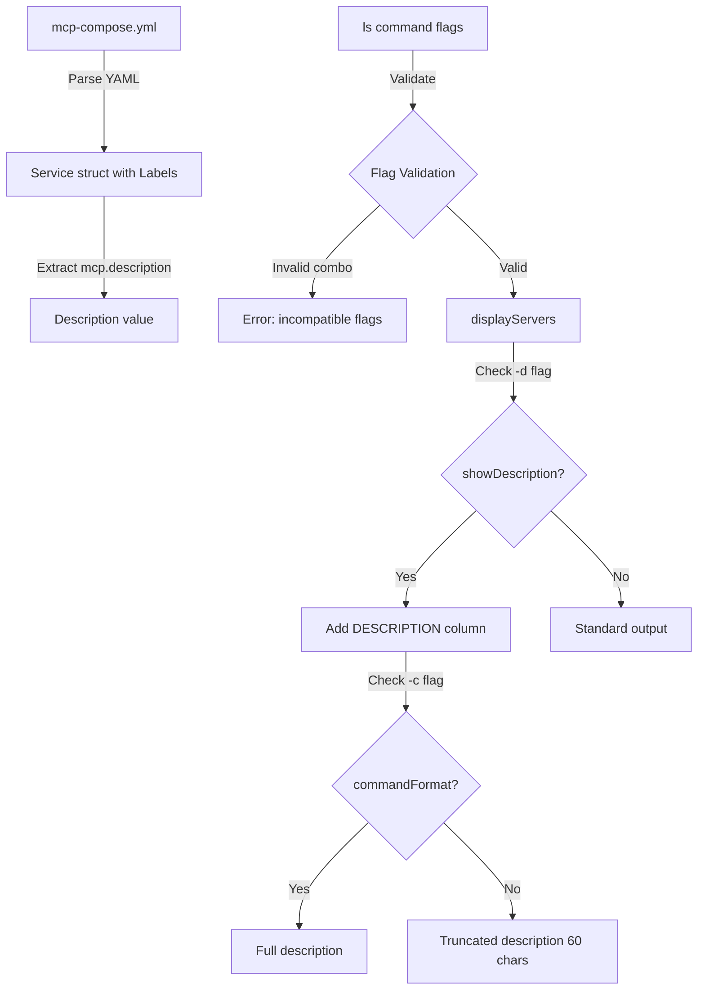

# Design Document: MCP Server Description Display

## Overview

This feature extends the MCP CLI's `ls` command to support displaying server descriptions. The implementation adds a new `mcp.description` label field that developers can use in their YAML configurations, and a `-d` flag to display these descriptions in the command output.

The design follows the existing patterns in the codebase:

- Labels are already parsed from YAML into `map[string]string` in the Service struct
- The `ls` command already supports multiple output formats via flags
- Tabwriter is used for aligned tabular output

## Architecture



## Components and Interfaces

### 1. Flag Definition (cmd/list.go)

Add a new boolean flag variable and register it with Cobra:

```go
var showDescription bool

func init() {
    // ... existing flags ...
    listCmd.Flags().BoolVarP(&showDescription, "description", "d", false,
        "Show server descriptions")
}
```

### 2. Flag Validation (cmd/list.go)

Add validation in the command's Run function to check for incompatible flag combinations:

```go
func validateDescriptionFlag() error {
    if showDescription && (showStatus || toolFilter != "" || allTools) {
        return fmt.Errorf("the -d/--description flag cannot be combined with " +
            "-s/--status, -t/--tool, or --all-tools flags")
    }
    return nil
}
```

### 3. Description Extraction Helper (cmd/types.go)

Add a helper function to extract the description from a service's labels:

```go
func GetDescription(service Service) string {
    if desc, ok := service.Labels["mcp.description"]; ok {
        return desc
    }
    return ""
}
```

### 4. Description Truncation Helper (cmd/types.go)

Add a helper function to truncate descriptions for display:

```go
const MaxDescriptionLength = 60

func TruncateDescription(desc string, maxLen int) string {
    if len(desc) <= maxLen {
        return desc
    }
    return desc[:maxLen-3] + "..."
}
```

### 5. Modified Display Functions (cmd/list.go)

Update `displayServers` and `printServerRow` to handle the description column:

- Add DESCRIPTION header when `-d` flag is set
- Append description to each row
- Apply truncation unless `-c` flag is also set

## Data Models

### Existing Service Struct (unchanged)

The existing `Service` struct already supports the `mcp.description` label through its `Labels` field:

```go
type Service struct {
    Command     string            `yaml:"command"`
    Image       string            `yaml:"image"`
    Environment map[string]string `yaml:"environment"`
    Labels      map[string]string `yaml:"labels"`
    Volumes     []string          `yaml:"volumes"`
}
```

The `mcp.description` label is accessed via `service.Labels["mcp.description"]`.

### Example YAML Configuration

```yaml
services:
  aws-api:
    command: uvx awslabs.aws-api-mcp-server@latest
    environment:
      AWS_REGION: us-east-1
    labels:
      mcp.profile: work, aws
      mcp.description: Direct AWS CLI execution with natural language support
```

### Output Format Examples

**Simple format with `-d`:**

```
NAME      PROFILES     DESCRIPTION
----      --------     -----------
aws-api   work, aws    Direct AWS CLI execution with natural language...
time      default
```

**Long format with `-d -l`:**

```
NAME      PROFILES     COMMAND                              ENVVARS      DESCRIPTION
----      --------     -------                              -------      -----------
aws-api   work, aws    uvx awslabs.aws-api-mcp-server...    AWS_REGION   Direct AWS CLI execution with natural...
```

**Command format with `-d -c` (full description):**

```
NAME      COMMAND                                                    DESCRIPTION
----      -------                                                    -----------
aws-api   AWS_REGION=us-east-1 uvx awslabs.aws-api-mcp-server...    Direct AWS CLI execution with natural language to AWS CLI command suggestions and validated AWS CLI command execution.
```

## Correctness Properties

_A property is a characteristic or behavior that should hold true across all valid executions of a system—essentially, a formal statement about what the system should do. Properties serve as the bridge between human-readable specifications and machine-verifiable correctness guarantees._

Based on the prework analysis, the following properties can be tested:

### Property 1: Description Extraction Preserves Content

_For any_ service with a `mcp.description` label containing any valid string (including spaces, punctuation, and special characters), the `GetDescription` function SHALL return the exact same string without modification.

**Validates: Requirements 1.1, 1.3**

### Property 2: Truncation Applies Correctly

_For any_ description string longer than 60 characters, the `TruncateDescription` function SHALL return a string of exactly 60 characters ending with "...". _For any_ description string of 60 characters or fewer, the function SHALL return the original string unchanged.

**Validates: Requirements 6.3**

### Property 3: Command Format Shows Full Description

_For any_ description string of any length, when the `-c` flag is used with `-d`, the output SHALL contain the complete description without truncation.

**Validates: Requirements 4.3, 6.4**

### Property 4: Description Column Position

_For any_ output format when `-d` flag is used, the DESCRIPTION column SHALL appear as the last column in the header row.

**Validates: Requirements 3.1**

## Error Handling

### Invalid Flag Combinations

When the `-d` flag is combined with incompatible flags, the CLI SHALL:

1. Print an error message to stderr explaining the incompatibility
2. Exit with status code 1
3. Not produce any server listing output

**Error message format:**

```
Error: the -d/--description flag cannot be combined with -s/--status, -t/--tool, or --all-tools flags
```

### Missing Description Label

When a service does not have a `mcp.description` label:

- The `GetDescription` function returns an empty string
- The output displays an empty cell in the DESCRIPTION column
- No error is raised (this is expected behavior)

## Testing Strategy

### Unit Tests

Unit tests should cover specific examples and edge cases:

1. **Flag registration**: Verify `-d` and `--description` flags are registered
2. **Flag validation**: Test each incompatible flag combination returns error
3. **Empty description**: Test services without `mcp.description` label
4. **Truncation boundary**: Test descriptions at exactly 60, 59, and 61 characters
5. **Special characters**: Test descriptions with quotes, newlines, unicode

### Property-Based Tests

Property-based tests validate universal properties across generated inputs. Use Go's `testing/quick` package or a library like `gopter` for property-based testing.

**Configuration:**

- Minimum 100 iterations per property test
- Each test must reference its design document property

**Test Tags:**

- `Feature: mcp-description-display, Property 1: Description extraction preserves content`
- `Feature: mcp-description-display, Property 2: Truncation applies correctly`
- `Feature: mcp-description-display, Property 3: Command format shows full description`
- `Feature: mcp-description-display, Property 4: Description column position`

### Test File Location

Tests should be placed in `cmd/list_test.go` following Go conventions for test file placement alongside the implementation.
